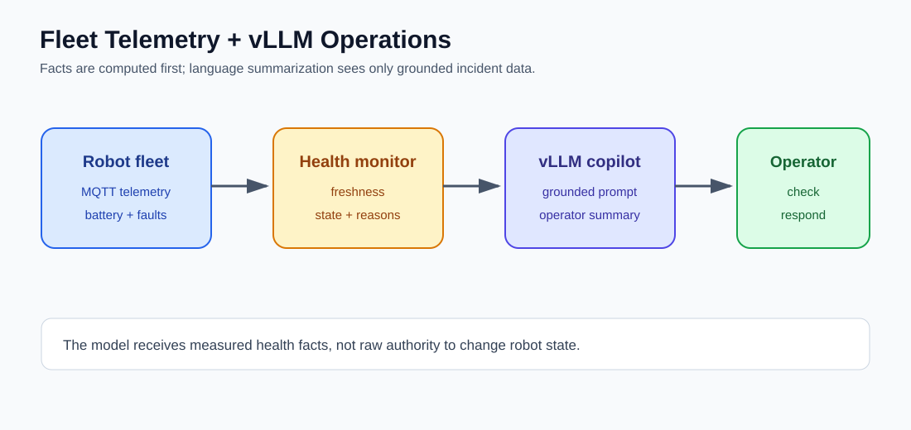
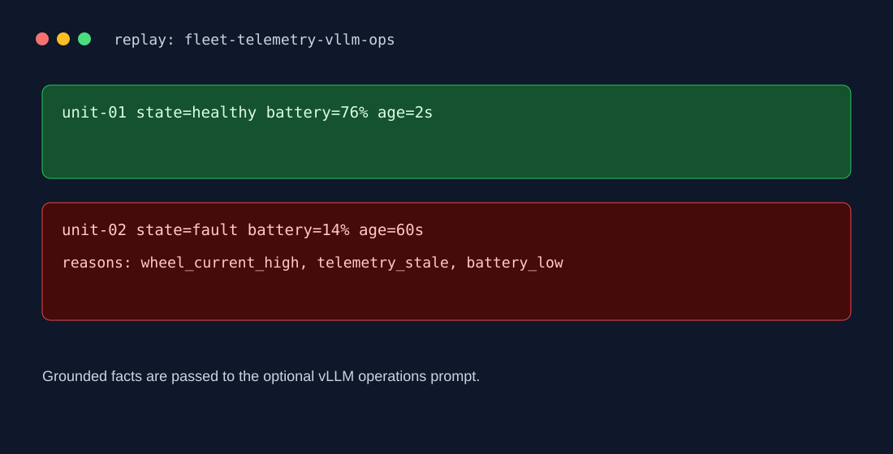

# Fleet Telemetry and vLLM Operations Copilot





A robotics fleet observability project. Robots publish structured telemetry over MQTT; the monitor validates messages, computes freshness/battery/error health, and optionally sends only the derived incident facts to a vLLM operations copilot.

## Replay actual message shapes

```powershell
$env:PYTHONPATH = "src"
python -m fleet_ops.cli data\telemetry.jsonl --now 1700000060
```

Each output line contains the robot ID, health state, and measured reasons. The fixture is a replay dataset. Live deployment can use `paho-mqtt` through the adapter boundary in `mqtt_adapter.py`.

## MQTT contract

Topic shape: `robots/{robot_id}/telemetry`

Payload fields: `timestamp_s`, `battery_pct`, `x_m`, `y_m`, `faults`, and optional `temperature_c`.

For production MQTT, configure TLS, authentication, topic authorization, QoS/session policy, retained status, and an explicit clock strategy. This repository does not claim broker connectivity without those deployment settings.

## vLLM boundary

`incident_prompt.py` creates a grounded prompt from computed facts. It never asks the model to infer missing telemetry. A future operator UI can send that prompt to an OpenAI-compatible vLLM endpoint and display the response alongside the original facts.

## NVIDIA / fleet operations paths

- `fleet_ops.nvidia_health` parses real Jetson `tegrastats`-style RAM, CPU, and GR3D utilization lines.
- `fleet_ops.prometheus` exports robot freshness/battery metrics plus Jetson health in Prometheus text format.
- This supports Jetson edge observability alongside Triton or TensorRT inference metrics; no GPU utilization is claimed unless an actual `tegrastats` line is supplied.

Official references: [Triton Inference Server](https://docs.nvidia.com/deeplearning/triton-inference-server/user-guide/docs/) and [TensorRT](https://developer.nvidia.com/tensorrt).
